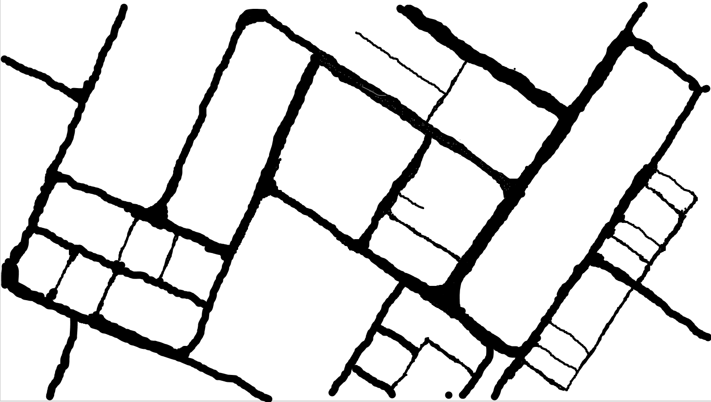

# Training a Self Driving car using deep Q-Learning

## Introduction

-  Reinforcement learning is the training of machine learning models to make a sequence of decisions. The agent learns to achieve a goal in an uncertain, potentially complex environment. In reinforcement learning, an artificial intelligence faces a game-like situation. The computer employs trial and error to come up with a solution to the problem. To get the machine to do what the programmer wants, the artificial intelligence gets either rewards or penalties for the actions it performs. Its goal is to maximize the total reward.
- Although the designer sets the reward policy–that is, the rules of the game–he gives the model no hints or suggestions for how to solve the game. It’s up to the model to figure out how to perform the task to maximize the reward, starting from totally random trials and finishing with sophisticated tactics and superhuman skills. By leveraging the power of search and many trials, reinforcement learning is currently the most effective way to hint machine’s creativity. In contrast to human beings, artificial intelligence can gather experience from thousands of parallel gameplays if a reinforcement learning algorithm is run on a sufficiently powerful computer infrastructure.

## Components of the project

1. __Agent__

    - Agent in this project is a car. FYI this is Tesla car XD

        

    - This is the car which travels on road
    - There will be three censors at front of car 
        - One censor at front another two at 60 degrees either side of the middle censor.
        - Observe the censors in [this](https://www.youtube.com/watch?v=Gj1HzlnH-vc) video
    - censors help the car in generating features regarding the position of the car

2. __Environment__
    - This is the main map that will be shown in UI
    

    - This is the environment which provides feed back to censors

    

    - This mask is hand drawn by me. It is used to simulate an environment for project on which car learns to drive
    - If you observe carefully, there are some grey marks which simulate pot holes on road
        - These are roads form which car should eventually avoid travelling from
    - This mask essentially provide the information to censors. If the pixel value on the censor is 0(black) it means that the car is on road.
    - There are source and destination on the map. Small images of office, home and airport are interchabley used as source destination of the environment

3. __Reward System:__
    - There are 3 rewards
        1. Reward for staying on road
        2. Reward for going closer to destination 
        3. Living penality
    
    - Reward system is the crux of the any RL system and need effort for fine tuning. So that the car behaves in expected way
    - Reward system can be found in Game.update() function in map.py

4.  __Deep Learning Model:__
    - Look at Input and Output Diagram of the Deep Learning model

    

    - This model aligns its weights such that the car can travel on roads from source to destination.
    - Models inputs are
        - +ve and -ve orientation of the car in map. Angle of the car in the map.
        - Average of the pixels under three censors.
    - Output consists of the weights representing the action to be take by car.

## Training
__NOTE__ : State Represents the current state of car. We generally Input state of the car to the Deep Learning Model
- There is a memory Buffer of the past events which save the following.
    - __Last state__ : Last state of the agent 
    - __Current State__ : Current state of the agent
    - __Last action__ : Action Took on _last state_
    - __last reward__ : Reward obtained for the _last action_

- Loss can be calculated using Q-Learning equation derived from temporal difference of Bellmanford equation

- Above equation is the loss function

    - Here R(s,a) is the reward obtained from the last move
    - Q(s', a') model predicted outputs for next state
    - Qt-1(s, a) is model predicted output for current state
    - R(s,a) is batch rewards fot the current state
    - Gamma is Discount factor. It is the value responsible for Leaving a trail for the agent about directions to perform the action 
    - In simple terms a deep learning model is trained to remember what should have been done to reach the maximum reward based on past results

## Demo :
- Demo can be found [here](https://www.youtube.com/watch?v=Gj1HzlnH-vc) (youtube link)
