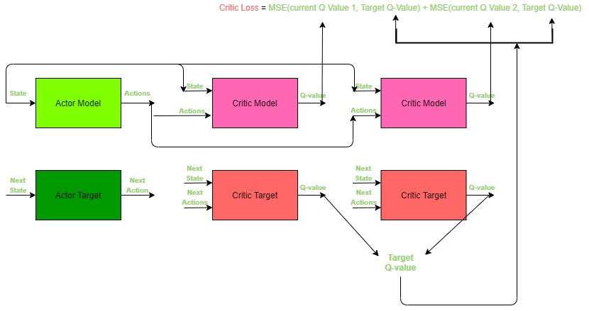

# Training a Self Driving car using deep Twin Delayed Deep Deterministic Network

# Introduction

-  Reinforcement learning is the training of machine learning models to make a sequence of decisions. The agent learns to achieve a goal in an uncertain, potentially complex environment. In reinforcement learning, an artificial intelligence faces a game-like situation. The computer employs trial and error to come up with a solution to the problem. To get the machine to do what the programmer wants, the artificial intelligence gets either rewards or penalties for the actions it performs. Its goal is to maximize the total reward.
- Although the designer sets the reward policy–that is, the rules of the game–he gives the model no hints or suggestions for how to solve the game. It’s up to the model to figure out how to perform the task to maximize the reward, starting from totally random trials and finishing with sophisticated tactics and superhuman skills. By leveraging the power of search and many trials, reinforcement learning is currently the most effective way to hint machine’s creativity. In contrast to human beings, artificial intelligence can gather experience from thousands of parallel gameplays if a reinforcement learning algorithm is run on a sufficiently powerful computer infrastructure.


# Demo :
__NOTE__ : In the below video top right corner and bottom left corner are used as source and destination
- Demo can be found [here](https://youtu.be/A6wUZMdBIzE) (youtube link)
- These are some small instances of recording while the model was training.
- It can be observed that the model is trying to reach the destination and also trying to stay on roads.


# Inference
- To run the trained model use
``` sh
python inference.py
```
- And then Load the model
- __NOTE__ : I have trainied a better model but failed to save the model. But if you run this model you can clearly see that the model is trying to stay on roads while moving towards destination. But the current model can get trained better with more computation.


# Components of the project


1. __Agent__

    - Agent in this project is a car. FYI this is Tesla car XD

        

    - This is the car which travels on road
    - the state of the agent is captured using the small cutout image from the surroundings of agent. 
    - This image is passed trough the CNN for generating feature vector for fully connected layer

2. __Environment__
    - This is the main map that will be shown in UI
    

    - This is the environment which provides feed back to censors

    

    - This mask is used to simulate an environment for project on which car learns to drive
    - The image which is passed trough CNN is cropped from this image based on the position of the car
    - There are source and destination on the map. Small images of office, home and airport are interchabley used as source destination of the environment

3. __Reward System:__
    - There are 3 rewards
        1. Reward for staying on road
        2. Reward for going closer to destination 
        3. Living penality
    
    - Reward system is the crux of the any RL system and need effort for fine tuning. So that the car behaves in expected way
    - Reward system can be found in Game.update() function in map.py

## __Reinforcement Learning Model and Working:__
-

   


### Step 1: 
- Initialise the replay buffer wiht "n" random records


```python
class ReplayBuffer(object):
    def __init__(self, max_size = 1e6):
        self.storage = []
        self.max_size = max_size
        self.ptr = 0

    def add(self, transition):
        if len(self.storage) = self.max_size :
            self.storage[int(self.ptr)] = transition
            self.ptr = (self.ptr + 1) % self.max_size
        else:
            self.storage.append(transition)

    def sample(self, batch_size) :
        ind = np.random.randint(0, len(self.storage), batch_size)
        batch_states, batch_next_states, batch_actions, batch_rewards, batch_dones = [], [], [], [], []
        for i in ind:
            state, next_state, action, reward, done = self.storage[i]
            batch_states.append(np.array(state, copy = False))
            batch_next_states.append(np.array(state, copy = False))
            batch_actions.append(np.array(state, copy = False))
            batch_rewards.append(np.array(state, copy = False))
            batch_dones.append(np.array(state, copy = False))

        return np.array(batch_states), np.array(batch_next_states), np.array(batch_actions),\
                np.array(batch_rewards).reshape(-1,1), np.array(batch_dones).reshape(-1,1)


```

### Step 2:
- Initialise Actor model and Actor target \
\

```python
class Actor(nn.Module):
    def __init__(self, state_dims, action_dims, max_action):
        super(Actor, self).__init__()
        self.layer_1 = nn.Linear(state_dims, 400)
        self.layer_2 = nn.Linear(400, 300)
        self.layer_3 = nn.Linear(300, action_dims)
        self.max_action = max_action

    def forward(self, x):
        x = F.relu(self.layer_1(x))
        x = F.relu(self.layer_2(x))
        x = self.max_action * torch.tanh(self.layer_3(x))
        return x

```
- Each actor model structure is as following image\


### Step 3:
- Initialise Critic models and critic targets
- In our case we took 2 - Critic Models and 2 corresponding Critic Targets\
\

```python
class Critic(nn.Module):
    def __init__(self, state_dims, action_dims):
        super(Critic, self).__init__()
        self.layer_1 = nn.Linear(state_dims + action_dims, 400)
        self.layer_2 = nn.Linear(400, 300)
        self.layer_3 = nn.Linear(300, action_dims)

        self.layer_4 = nn.Linear(state_dims + action_dims, 400)
        self.layer_5 = nn.Linear(400, 300)
        self.layer_6 = nn.Linear(300, action_dims)

    def forward(self, x, u):
        xu = torch.cat([x, u], 1)
        x1 = F.relu(self.layer_1(xu))
        x1 = F.relu(self.layer_2(x1))
        x1 = self.layer_3(x1)

        x2 = F.relu(self.layer_4(xu))
        x2 = f.relu(self.layer_5(x2))
        x2 = self.layer_6(x2)

        return x1, x2

    def Q1(self, x, u):
        xu = torch.cat([x, u], 1)
        x1 = F.relu(self.layer_1(xu))
        x1 = F.relu(self.layer_2(x1))
        x1 = self.layer_3(x1)
        return x1

```
- Each Critic model Structure is as following image


### initialization step before step 4:
```python
class T3D(object):
    def __init__(self, state_dims, action_dims, max_action):
        self.actor = Actor(state_dims, action_dims, max_action).to(device)
        self.actor_target = Actor(state_dims, action_dims, max_action).to(device)
        self.actor_target.load_state_dict(self.actor.state_dict)

        self.actor_optimizer = torch.optim.Adam(self.actor.parameters())

        self.critic = Critic(state_dims, action_dims).to(device) ## how can critic output equal action dims
        self.critic_target = Critic(state_dims, action_dims, action_dims).to(device)
        self.critic_target.load_state_dict(self.critic.state_dict)

        self.critic_optmizer = torch.optim.Adam(self.critic.parameters())
        self.max_action =  max_action

```

### Step 4:
- Import a batch of transition records from replay buffer as showin in step1
- Each record consists of (current state, next state, current action , next record, batch done)
```python
def train(self, replay_buffer, iterations, batch_size = 100, discount = 0.99, tau = 0.005, policy_noise = 0.2, noise_clip = 0.5, policy_freq = 2) :
  for it in range(iterations):
      batch_states, batch_next_states, batch_actions, batch_rewards, batch_dones = replay_buffer.sample(batch_size)
      state = torch.Tensor(batch_states).to(device)
      next_state = torch.Tensor(batch_next_states).to(device)
      action = torch.Tensor(batch_actions).to(device)
      reward = torch.Tensor(batch_rewards).to(device)
      done = torch.Tensor(batch_dones).to(device)
```

### Step 5:
- Predict Target for next action trough Actor Target\
  \

```python
    next_action = self.actor_target.forward(next_state)
```
### Step 6:
- Add gaussian noise to the next action prediction
- This will help the Actor to explore new paths or with stratigies to perform better
```python
    noise = torch.Tensor(batch_actions).data.normal_(0, policy_noise).to(device)
    noise = noise.clamp(-noise_clip, noise_clip)
    next_action = (next_action + noise).clamp(-self.max_action, self.max_action)
```

### Step 7:
- Predict Q values to the next state and next action from the critic Target\
  \

```python
    target_Q1, target_Q2 = self.critic_target.forward(next_state, next_action)
```

### Step 8:
- Calculate minimum Q value from all the critic targets
- This prevents too optmistic estimates of the value of next states\
  \

```python
    target_Q = torch.min(target_Q1, target_Q2)
```

### Step 9:
- calculate the final target Q value including the reward
- Q = Reward + gamma * minimum(all target Q values)
- If we observe the above step carefully it is Bellmen ford equation we are using to rain the agent
- Observe the following diagram and formula and compare it with what is happening in current step\
  \


```python
    target_Q = reward + ((1 - done) * discount * target_Q).detach()
```

### Step 10:
- Calculate Critic model current Q-values from current state and action \
  \

```python
    current_Q1, current_Q2 = self.critic.forward(state, action)
```

### Step 11:
- Now as we have already calculated current steps expected Max Q-value from step 9 we can calculate Loss for the Critic model just by calculating difference between Q calculated in step 9(Target Q-value) and step 10(Current Q-value) as shown in figure.
- here MSE() refers to mean square error
  \

```python
    critic_loss = F.mse_loss(current_Q1, target_Q) + F.mse_loss(current_Q2, target_Q)
```

### Step 12:
- Back propagate all the Ctitic models from the loss calculated in step 11\
  \

```python
    self.critic_optmizer.zero_grad()
    critic_loss.backward()
    self.critic_optmizer.step()
```

### Step 13:
- repeat step 4-12 for policy_freq nouber of iterations
- After every policy_freq number of iterations, backpropagate Actor model using the loss calculated from critic model as shown below


```python
if it % policy_freq == 0:
    actor_loss = -(self.critic.Q1(state, self.actor(state)).mean())
```

  

```python
    self.actor_optimizer.grad_zero()
    actor_loss.backward()
    self.actor_optimizer.step()
```

### Step 14:
- Update weights of actor and critic target models using poliyak averaging
- tetha' = tou * tetha + (1 - tou) * tetha' \
  \

```python
    for param, target_param in zip(self.actor.parameters(), self.actor_target.parameters()):
        target_param.data.copy_(tau * param.data + (1 - tau) * target_param.data)

    for param, target_param in zip(self.critic.parameters(), self.critic_target.parameters()):
        target_param.data.copy_(tau * param.data + (1 - tau) * target_param.data)
```


## Training
__NOTE__ : State Represents the current state of car. We generally Input, state of the car to the Deep Learning Model
- There is a memory Buffer of the past events which save the following.
    - __Last state__ : Last state of the agent 
    - __Current State__ : Current state of the agent
    - __Last action__ : Action Took on _last state_
    - __last reward__ : Reward obtained for the _last action_


# Parameters and done condition :
- image size : 60x60
- Reward system 
    - collides the walls : -1
    - reaches the destination : 2
    - move on sand & go away from destination : -0.5
    - move on sand & go towards destination : -0.2
    - move on road & go away from destination : -0.24
        - __moving towards destination is more important than staying on road__
        - __this essentially helps to stop circling effect in long training__
    - move on road & go towards the destination : 0.1
- batch size : 30
- buffer capacity : 2000
- start time steps before using model to predict action : 900
- These are some key parameters i have used

